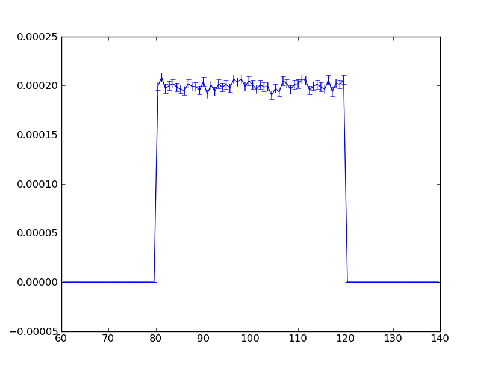

.. _Components:

Components
==========

Generic components provided by MCViNE
-------------------------------------

.. _ndmonitor:

NDMonitor
^^^^^^^^^

NDMonitor is a rectangular monitor with a finite size (width and height) 
and infinitisimal thickness.
It can be used to measure a multi-dimensional histogram
of intensities.
The quantities to measure can be specify through command line.

Examples
""""""""

* I(tof): --monitor=NDMonitor(tof)
* I(energy): --monitor=NDMonitor(energy)
* I(x,y):  --monitor=NDMonitor(x,y)
* I(x,divergence of x): --monitor=NDMonitor(x, divx)
* I(x,y,tof):  --monitor=NDMonitor(x,y,tof)

Quick tutorial
""""""""""""""

Create an instrument simulation application::

 $ mcvine-create-instrument-simulation-application --name=sd --components=source,detector

Assign components::

 $ ./sd --source=Source_simple --detector="NDMonitor(energy)"  --dump-pml

Configure::

 $ ./sd \
 --geometer.detector="(0,0,10),(0,0,0)" \
 --source.width=0.1 --source.height=0.1 --source.radius=0 \
 --source.xw=0.1 --source.yh=0.1 --source.dist=10 \
 --source.E0=100 --source.dE=20 \
 --detector.title="I(E)" --detector.yheight=0.1 --detector.xwidth=0.1 \
 --detector.nenergy=100 --detector.energymin=60 --detector.energymax=140 \
 --dump-pml

Run::

 $ ./sd --ncount=1e5

See result::

 $ PlotHist.py out/ienergy.h5

.. _monochromaticsource:

Monochromatic source
^^^^^^^^^^^^^^^^^^^^
This is a neutron source that always generates the same neutron.
It exists mostly for debugging purpose.

Quick tutorial
""""""""""""""

Create an instrument simulation application::

 $ mcvine-create-instrument-simulation-application --name=sd --components=source,detector

Assign components and configure::

 $ ./sd \
 --source=MonochromaticSource --source.energy=70 \
 --detector=E_monitor --detector.filename=IE.dat \
 --dump-pml

Run::

 $ ./sd --ncount=1e3

See result::

 $ PlotHist.py out/IE.h5

.. image:: images/monosource-ie.png
   :width: 50%

.. _neutronprinter:

Neutron printer
^^^^^^^^^^^^^^^
Neutron printer can be used to print out neutrons in the beam.
Actually this can be better achieved by uing 
:ref:`the tracer <fundamentals-tracer>`.

Quick tutorial
""""""""""""""

Create an instrument simulation application::

 $ mcvine-create-instrument-simulation-application --name=sd --components=source,detector

Assign components::

 $ ./sd --source=Source_simple --detector="NeutronPrinter"  --dump-pml

Run::

 $ ./sd --ncount=5

.. _neutronstorage:

Neutron storage
^^^^^^^^^^^^^^^

In mcvine, you can save neutrons to a neutron storage, and
reuse it in later simulations.

Following components are created for this purpose:

* NeutronFromStorage: retrieve neutrons from a storage and send them running
* NeutronToStorage: save neutrons in simulation to a storage

Example usages
""""""""""""""

1. Separate simulations of ARCS beam and sample scattering
Simulation of an ARCS experiment can be done in two steps.
The first step is to simulation the neutron component chain 
down to the sample position::

 moderator -> core-vessel-insert -> shutter-guide -> guide-1 ->
   ... -> fermi-chopper -> ... -> guide-5 -> neutron-to-storage

Result of the first simulation step is a data file that contains
all the neutrons reach the sample position.
Those neutrons can be reused in various futher simulations.

For example we can simulate the scattering of neutrons from sample::

 neutron-from-storage -> sample -> arcs-detector-system

We can use different samples in different simulations that all
use the neutrons from the same neutron storage.

We could also put various monitors to examine the neutrons
in the storage::

 neutron-from-storage -> monitor

Tools
"""""

Count neutrons in a storage -- "mcvine-neutron-storage-count-neutrons"
''''''''''''''''''''''''''''''''''''''''''''''''''''''''''''''''''''''

Signature::

 $ mcvine-neutron-storage-count-neutrons <neutron-file>

- Input: a neutron file
- Output: Number of neutrons in the given storage

Compute total intensity in a storage -- "mcvine-neutron-storage-total-intensity"
''''''''''''''''''''''''''''''''''''''''''''''''''''''''''''''''''''''''''''''''

Signature::

 $ mcvine-neutron-storage-total-intensity <neutron-file>

- Input: a neutron file
- Output: Total neutron intensity in the given storage

Merge neutron storages -- "mcvine-neutron-storage-merge"
''''''''''''''''''''''''''''''''''''''''''''''''''''''''

Signature::
 
 $ mcvine-neutron-storage-merge \
     -files=<neutron-files-to-merge> \
     -output=<output-neutron-file>

- Input: neutron file(s)
- Output: merged neutron file

Print neutrons -- "mcvine-neutron-storage-print-neutrons"
'''''''''''''''''''''''''''''''''''''''''''''''''''''''''
Signature::
 
 $ mcvine-neutron-storage-print-neutrons \
     -filename=<neutron-file> \
     -n=<number-of-neutrons>

- Input: neutron file(s)
- Output: merged neutron file

Error propagation when using neutron storage
""""""""""""""""""""""""""""""""""""""""""""

When we use neutron storage, we need to make sure the
neutrons saved in the storage have enough statistics
for the simulations that use the storage to be successful.

As discussed in :ref:`fundamentals-errorbar-errorprop`, 
the error bar of simulated intensity of a simulation using neutron storage
is given by

.. math::
   Err^2(I) = \Delta^2_{intrinsic} \times I^2  + \sum{p_i^2}

and the instrinsic error induced by using the neutron
storage could be approximated from the data of the simulation
that generated the neutron storage:

.. math::
   \Delta^2_{instrinsic} = \sum p_{ns, i}^2 / (\sum p_{ns, i})^2

where the subscript ":math:`ns`" denotes the simulation that generates
the neutron storage.

You can see that the errobar of a simulation involves a neutron
source that replays neutrons in a neutron storage is limited by
the error bar of the simulation that leads to the neutron storage.
So the rule of thumb of using neutron storage is that
it is necessary to make sure to have a reasonably good statistics 
for the simulation of the neutron storage before using it for
other simulations.

.. _detectorsystem:

Detector System
^^^^^^^^^^^^^^^
DetectorSystemFromXml.

To see the events in an events file::

 from mccomponents.detector.event_utils import readEvents
 events = readEvents(filepath)
 print events

.. _mcstas-comp-lib:

McStas component librarry
-------------------------

MCViNE is teamed with
`McStas <http://mcstas.org>`_ project to provide
access to McStas components from mcvine.
If you run::

 $ mcvine-list-components

you will see a lot of components coming from mcstas, for example "Monitor_4PI".
You can use it like any other mcvine components::

 $ <simapp> --monitor=Monitor_4PI --dump-pml

For more details on any McStas component (e.g. Monitor_4PI), 
you can use the mcvine command line interface::

 $ mcvine component info Monitor_4PI

Or you can visit the McStas documentation at 
http://mcstas.org/documentation/

.. _user-defined-mcstas-components:

User-defined mcstas components
^^^^^^^^^^^^^^^^^^^^^^^^^^^^^^

It is not unusual that a user wants to use a mcstas component he 
writes himself. To use a user-defined mcstas component, run::

 $ mcvine-compile-mcstas-component --filename=<user-defined-component-file> --category=<category.>

Here, <user-defined-component-file> is the path to the mcstas component file
you created, <category> is the category this component belongs to.
For example::

 $ mcvine-compile-mcstas-component --filename=Al_window.comp --category=optics

and mcvine will start compiling the component and put it into the system.
If the compiling failed, please don't hesitate to post your questions
to mcvine-users@googlegroups.com 

If everything goes smoothly, now you can use this component just like any other components::

 $ mcvine component info Al_window

.. _vitess-comp-lib:

Vitess component librarry
-------------------------

This is still experimental.
