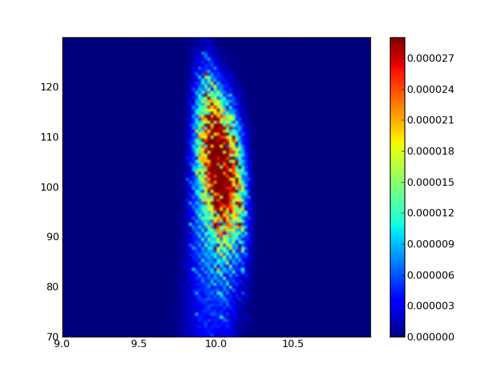

.. _tutorials-arcs:

Simulation of ARCS experiments
==============================

Tutorial 1: full simulation of an experiment of a polycrystalline Vanadium sample
---------------------------------------------------------------------------------

Here is an example of a full simulation of an ARCS experiment 
using a polycrystalline vanadium sample.

The basic procedure is

* simulate the neutrons at the sample position
* "replay" neutrons at the sample position to send them to the sample to be scattered, and save the scattered neutrons
* send the scattered neutrons to ARCS detector system, which generates "event-mode" data 
* reduce "event-mode" data to I(Q,E)

Create a working directory::

  $ mkdir -p arcs-polyV
  $ cd arcs-polyV

Let us suppose that the environment variable "workdir" is set to this new
directory.

Incident beam
"""""""""""""
In this step we simulate the ARCS instrument from moderator
down to the sample position.

Create a directory ::

 $ mkdir mod2sample
 $ cd mod2sample

Suppose
* the incident energy to simulate is 100 meV
* fermi chopper radius is 58.01 cm
* fermi chopper frequency is 600 Hz
* T0 chopper frequency is 120 Hz

create simulation configuration by::

 $ arcs-m2s -E=100 -T0_nu=120 -fermi_bladeradius=0.5801 -fermi_nu=600 --- -h -dump-pml=yes

This will generate a file "arcs_moderator2sample.pml".

Now we will need a data file that contains Monte-carlo simulated
neutron profile for the moderator::

 $ ln $MCVINE_DIR/share/mcvine/instruments/ARCS/source_sct521_bu_17_1.dat

Now run the simulation::
 
 $ arcs_moderator2sample.py -ncount=1e8 -buffer_size=10000000

Output: out/mon1-tof.h5
Plot::
 
 $ PlotHist.py out/mon1-tof.h5

Output: out/neutrons
See how many neutrons are there::

 $ mcvine-neutron-storage-count-neutrons out/neutrons

Scattering of incident neutrons by sample
"""""""""""""""""""""""""""""""""""""""""
Create a directory for this::
 
 $ mkdir -p $workdir/scattering
 $ cd $workdir/scattering

Create a script for this simulation::

 $ mcvine-create-instrument-simulation-application -name=ssd -components=source,sample,detector 

Configure the script to use the correct components and save the configuration::

 $ ./ssd -source=NeutronFromStorage -sample=SampleAssemblyFromXml -detector=NeutronToStorage -h -dump-pml=yes

Change the configuration by editing the file ssd.pml::

  <inventory>
  
    <component name="ssd">
        <property name="sequence">['source', 'sample', 'detector']</property>
        <facility name="source">sources/NeutronFromStorage</facility>
        <facility name="sample">samples/SampleAssemblyFromXml</facility>
        <facility name="detector">monitors/NeutronToStorage</facility>
  
        <property name="multiple-scattering">False</property>
  
        <property name="ncount">1e7</property>
        <property name="buffer_size">1000000</property>
  
        <property name="overwrite-datafiles">True</property>
        <property name="output-dir">out</property>
  
        <component name="sample">
            <property name="xml">V/sampleassembly.xml</property>
        </component>
  
  
        <component name="source">
            <property name="path">../mod2sample/out/neutrons</property>
        </component>
  
  
        <component name="detector">
            <property name="path">neutrons</property>
            <property name="append">False</property>
        </component>
  
  
        <component name="geometer">
            <property name="source">((0, 0, 13.45), (0, 0, 0))</property>
            <property name="sample">((0, 0, 13.6), (0, 0, 0))</property>
            <property name="detector">((0, 0, 13.6), (0, 0, 0))</property>
        </component>
  
    </component>
  
  </inventory>

Create sample assembly xml file ::

  $ mkdir V
  $ cd V

So we are now inside directory $workdir/scattering/V.
We need to create three files in this directory:

1. sampleassembly.xml -- the main file describes the whole sample assembly. It only contains one scatterer, V powder sample, in this case
2. V.xyz -- xyz file describing the crystal structure of V, the material
3. V-scatterer.xml  -- The file describing the kernels of the scatterer, the V sample.

Here are the contents of these files:

sampleassembly.xml::

 <SampleAssembly name="bcc V powder sample assembly">
  
  <PowderSample name="V" type="sample">
    <Shape>
      <block width="100*mm" height="100*mm" thickness="2*mm" />
    </Shape>
    <Phase type="crystal">
      <ChemicalFormula>V</ChemicalFormula>
      <xyzfile>V.xyz</xyzfile>
    </Phase>
  </PowderSample>
  
  <LocalGeometer registry-coordinate-system="InstrumentScientist">
    <Register name="V" position="(0,0,0)" orientation="(0,0,45)"/>
  </LocalGeometer>
 
 </SampleAssembly>

V.xyz::

 2
 3.02 0 0   0 3.02 0   0 0 3.02
 V 0  0  0
 V 0.5 0.5 0.5

V-scatterer.xml::

 <?xml version="1.0"?>
 
 <!DOCTYPE scatterer>
 
 <!-- mcweights: monte-carlo weights for 3 possible processes: 
 absorption, scattering, transmission -->
 <homogeneous_scatterer mcweights="0, 1, 0">
  
  <IsotropicKernel>
  </IsotropicKernel>
 
 </homogeneous_scatterer>

Run the simulation::

  $ ./ssd

Output: out/neutrons
See how many neutrons are there::

 $ mcvine-neutron-storage-count-neutrons out/neutrons

(Optional) check the I(Q,E) using an ideal I(Q,E) monitor::

 $ checksqe -source.path=out/neutrons -monitor.Ei=100 -monitor.Emin=-95 -monitor.Emax=95 -monitor.nE=190 -monitor.Qmin=0 -monitor.Qmax=13 -monitor.nQ=130

Tutorial 2: Compute resolution function in Q,E space
----------------------------------------------------

.. note::
 This should still work, but a quicker way is to first run arcs_beam
 simulation, and then run arcs-compute-IQE-resolution simulation.

Quick Overview
""""""""""""""

This example can be found in ::

 $MCVINE_DIR/share/mcvine/instruments/ARCS/simulations/resolution-calculator

To start, make a copy of that directory::

 $ cp -r $MCVINE_DIR/share/mcvine/instruments/ARCS/simulations/resolution-calculator <workdir>

Now cd into it::

 $ cd <workdir>

To run a moderator...sample simulation, cd into mod2sample::

 $ cd mod2sample

Take a look at the "run" script and modify it according to your needs,
and run it::

 $ ./run

After the simulation, you can find results in directories "out" and 
"out-analyzer". For example::

 $ PlotHist.py out-analyzer/ienergy.h5

.. figure:: images/ARCS/I_E.png
   :width: 50%

Next, go to the "QE" directory::

 $ cd ../QE

In this directory you can calculate resolution function for a
particular Q,E pair of your choice. To do that, take a look
at the "run" script and modify it to your needs, and run it::

 $ ./run

You should see a I(Q,E) plot after the simulation is done.

More details
""""""""""""

mod2sample
''''''''''
This directory runs the simulation of neutrons 
emitting from the moderator, going down the stream through
guides and choppers, until they arrive just before the
sample position.

The run script reads::

  python run.py  \
    -Ei=700 \
    -ncount=1e7 \
    -nodes=5 \
    -moderator_erange=660,770 \
    -fermichopper=700-0.5-AST \
    -fermi_nu=600 \
    -T0_nu=120 \
    -emission_time=-1 \
    -dry_run=off

where

- Ei: nominal incident neutron energy
- ncount: # of Monte Carlo samples
- nodes: # of nodes
- fermichopper: choice of Fermi chopper

QE
'''

In this directory, the neutrons simulated at sample position
in mod2sample are sent to a sample with delta function like
scattering kernel at the Q,E given by the user.
The scattered neutrons are intercepted by virtual ARCS 
detector system and that generates events to be stored
in an event-mode data file.
The data file is then reduced to I(Q,E).

The run script reads::

  python run.py \
    -ncount=1e6 \
    -nodes=2 \
    -Ei=700 \
    -Q=10 \
    -dQ=1 \
    -E=100 \
    -dE=20 \
    -mod2sample=../mod2sample \

where

- ncount: # of Monte Carlo samples
- nodes: # of nodes
- Ei: nominal incident energy
- Q, E: desired momentum and energy transfer
- dQ, dE: the momentum and energy ranges in which the
  reduced I(Q,E) will be
- mod2sample: the path to the directory where mod2sample simulation
  were run

Commands
--------

.. _arcs_beam:

arcs_beam
"""""""""

Compute neutrons at the sample position of ARCS beam.
The neutrons computed will be saved in a file, which
can be reused to simulate sample scattering.
So make sure to keep those neutron files somewhere,
and usually you don't want to delete them.

Run ::

 $ arcs_beam -h

to find help

.. _arcs-iqeres:

arcs-compute-IQE-resolution
"""""""""""""""""""""""""""

Compute I(Q,E) resolution function.

To run this simulation, you will need to compute neutrons at
sample position for ARCS. This can be done by running
the :ref:`arcs_beam <arcs_beam>` command.

Example command::

 $ arcs-compute-IQE-resolution --ncount=1e7 --nodes=10 --Ei=100 --Q=6  --E=20 --dQ=2 --dE=10 --mod2sample=/path/to/mod2sample

* ncount: Monte Carlo counts
* nodes: number of nodes
* Ei: nominal incident energy (meV)
* Q, E: momentum and energy transfer at which the resolution is calculated
* dQ, dE: range of momentum and energy transfer in which the resolution function is computed
* mod2sample: the path in which the moderator-to-sample simulation was performed.

arcs-neutrons2nxs
"""""""""""""""""

Convert scattered neutrons into nexus data file.

::

 $ arcs-neutrons2nxs --neutrons=<neutron-file> --nxs=<nexus-output-file> --workdir=<temporary-working-dir>

* neutrons: input neutron file. This file must be generated from a mcvine simulation of 
  sample-scattered neutrons
* nxs: output nexus data file. default: arcs-sim.nxs
* workdir: temporary working dir. default: work

