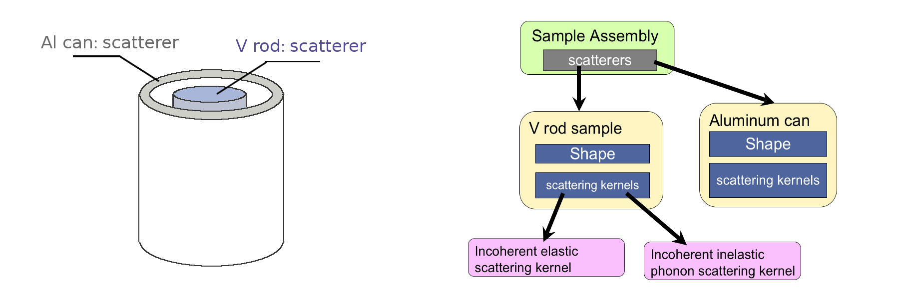
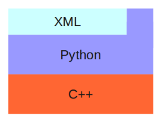
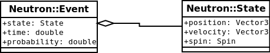
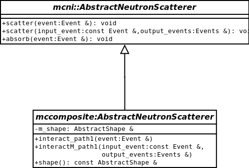
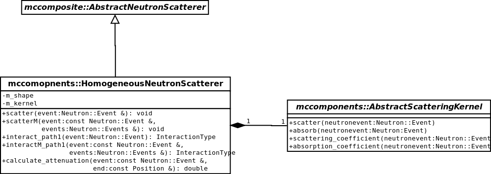
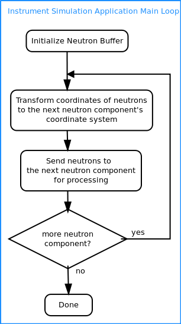

.. _philosophy:

Concepts
========

Here we present the engineering philosophy employed in mcvine.

We can divide legacy MC neutron scattering code to two categories:

* mcstas, IDEAS, vitess, etc., in which an instrument is simulated as a linear chain of components.
* MCNP and NISP, in which simulations are done by dividing space to regions.

The latter approach is much more generic and more powerful.
In pinciple, it can simulate arbitrary complex neutron scattering 
scenarios,  but 
they are quite difficult to set up and run, and most instrument scientists 
cannot go that route. 
The first approach (linear chain) is less accurate but easier to use compared
to MCNP and NISP. 
But still, only a few instrument scientists do that, and most users 
are not interested in MC simulations of neutron experiments mainly 
due to complexity of setting up such simulations.

MCViNE is engineered with the following goals in mind:

* Ease of use:  The software need to be usable by not only instrument 
  scientists, but also experimentalists who are not really into computing
* Generality and extensibility: It need to be able to handle neutron 
  scattering in a generic way and extensible to handle more and more 
  complex cases
* Compatibility: It should be able to make use of a large amount of 
  existing MC neutron scattering software packages.

To reach these goals, we employed a few design principles.
In spirit, these design principles can be sumarized as one guiding
principle:

* Prefer declarative programming paradigm whenever practical, over
  imperative programming.

It means that we try to start by define what a program should accomplish, 
instead of how it should accomplish it.
It means that we follow the following principles:

* Object oriented design to achieve data abastraction, encapsulation, modularity, and polymorphism
* Program to an interface, instead of an implementation
* Provide an easy way for users to configure simulations using simple, natural descriptions
  of the system, currently mainly by xml files. This configuration machinery can
  go fairly deep into the hierarchy that represents the simulation, including,
  for example, scattering kernel characteristics.

We also makes use of 

* Generic algorithms

to simply some implementations.

In the design, some well-established design patterns such as
visitor pattern and composite pattern are employed.

In the following, we will explain the architecture and design of mcvine
in more details.

.. _high-level-arch-users:

High level architecture from User's point of view
-------------------------------------------------

Instrument: a component chain
^^^^^^^^^^^^^^^^^^^^^^^^^^^^^
To users, the high level structure of mcvine is somewhat similar to
that of mcstas, IDEAS, vitess: a simulation consists of building
an instrument from a linear chain of neutron components.

.. image:: images/developerguide/component-chain.png
   :width: 75%

Each component is required to implement method "process" and
optionally "processM".

The "process" method takes one input: "neutrons" ::

 def process(neutrons):
     # process the input neutrons and generate output neutrons in-place

The "processM" method is the multiple-scattering version of
method "process".

As depicted in the figure, the output of the previous component
becomes the input for the next component, and the neutrons
never go backward in the component chain.

Sample Assembly: an arbitrary complex hierarchy of neutron scatterer
^^^^^^^^^^^^^^^^^^^^^^^^^^^^^^^^^^^^^^^^^^^^^^^^^^^^^^^^^^^^^^^^^^^^

The design that distinguishes MCViNE from other linear-chain MC neutron
code is its capability of describing sample in a fairly sophisticated
and generic manner. 
The entities (sample, sample container, furnace etc) at the sample
position are regarded as one composite entity which
is termed "sample assembly". 
A sample assembly consists of a list of neutron scatterers,
each scatterer has its shape and a list of scattering kernels.
Shown in the following figure is a typical sample assembly
with its hierarchicial representation in mcvine on the right:

Arbitrary many number of scatterers can be represented well
with mcvine, and arbitrary number of neutron scattering kernels
can be inserted into a neutron scatterer.
This decomposition scheme ensures maximum flexibility and can describe
a variety of kinds of samples.

It is also worth mentioning that the shape of a scatterer
can be an instance of any data object that inherits from
the abstract Shape base class in mcvine, as long as some requirements
are satisfied (more later). There are several built-in shapes,
and you can use constructive solid geometry to create
complex shapes from basic shapes, and you can extend mcvine
to support more shape types.

Similarly in philosophy, there is an abstract base class
for scattering kernels, and it is easy to extend mcvine
to define scattering kernels of different kinds.

In mcvine, multiple-scattering
is handled inherently.
If a user requests to simulate multiple-scattering,
the mcvine framework will allow neutrons to scatter multiple
times until neutrons have negligible probability.

Up to now, you may find mcvine very flexible and powerful,
but you will see the design of mcvine is actually even
more flexible than what have been discussed up to this point.
Please continue to read on to find out more details of
mcvine design if you are a developer.

Key design details for developers
---------------------------------

The general structure of mcvine is depicted in the following figure:

The main computation engines are implemented in c++ and then exported to
python through c++/python bindings (implemented by using boost python).
XML parsing (and rendering) are implemented in the python layer to allow
users to use mcvine from command line with xml input files.

c++
^^^

In the c++ layer, several different abstractions gradually decompose the
neutron scattering problem into pieces so that in several layers mcvine
can be extended and reused.

The object-oriented design of mcvine starts with the neutron event class
"Neutron::Event", which describes a neutron event by its state, time of flight,
and probability.
A neutron state, is decribed by its position, velocity, and spin.

Then we define an abstarct base class for all neutron scatterers, 
"mcni::AbstractNeutronScatterer", which does not have any properties,
but just defines its interface: methods "scatter", "absorb",
and optionally "scatterM" for multiple scattering.

Next, we introduce "shape" into our world,
A new abstract base class "mccomposite::AbstractNeutronScatterer"
can be simply regarded as 
"mcni::AbstractNeutronScatterer" with one additional property, "shape".

..
   This allows us to delegates "scatter" methods to
   "interact" methods for "mccomposite::AbstractNeutronScatterer".

Also introduced at this level is "mccomposite::CompositeNeutronScatterer", 
a class derived from "mccomposite::AbstractNeutronScatterer".
It allows users to construct one composite scatter from
a bunch of scatterers, each of which only needs to be a solid
instance of "mccomposite::AbstractNeutronScatterer".
Here, the "composite" design pattern is in use.

In a new namespace, "mccomopnents", we further specialize our abstraction
of neutron scatterer
(still quite generic though), by introducing the notion of "HomogeneousScatterer".
For "HomogeneousScatterer", the position where a neutron scattering happens
does not matter, and the position-independent scattering function is 
described by "ScatteringKernel".

The "mccomopnents::AbstractScatteringKernel" class is an abstract base class,
which allows users/developers to use/implement various flavors of 
scattering kernels.
One HomogeneousScatterer can also easily have more-than-one scattering kernels
with the help of class "CompositeScatteringKernel".

The gradual increase of specialization of the concept "neutron scatterer"
is the core of the mcvine c++ library; it allows reuse and extension
at all the levels of abstractions. 
For example, mcni::AbstractNeutronScatterer is very generic, 
and can be used to, for example, wrap components
in mcstas/vitess packages, and could be even used to implement scatterers
than consider wave-nature of the neutrons beam.
In "mccomoposite" namespace, we introduced shape and defined its abstract
interface.
Also defined are basic shapes such as sphere and cylinder, and also
opeorations such as union, difference, and dilation, to allow users
to create sophisticated shapes out of simple ones using constructive
solid geometery. Developers can extend mcvine to support more custom
shape types.

python and xml
^^^^^^^^^^^^^^
In the python and xml layer we are trying to expose the hierarchical
representation of the neutron scatterers in c++, and make it natural and easy to use.
The diagrams presented here is then quite similar to the structure
seen by users as presented in :ref:`high-level-arch-users`.

At the highest level, we are thinking of simulating neutrons going
through neutron components in a neutron instrument. 
Below is a diagram for a neutron component:

.. image:: images/developerguide/neutron-component-pyre.png
   :width: 45%

An instrument consists of a list of components and a geometer
registering positions of all components. 
A rough flow diagram of an instrument simulation looks like

The interface requirement of a neutron (python) component in mcvine is quite simple;
all is needed is a "process" method that takes one argument "neutrons".
This allows integrating legacy components like those of mcstas ones, 
for example.

For sample assemblies, the composite pattern and the visitor pattern 
are in heavy use. 

A sample assembly is represented in a hierarchical structure in which
the types of nodes inside the structure are different among different
sample assemblies. Visitor pattern is well suited for dealing with
such structures to allow flexible additions of operations on them,
such as view-rendering, user-interface-generation, and computation-engine-creation.

Here, the visitor of the fundamental importance is the visitor that
creates computation engine from user specification of the sample assembly.
This is done by

* parsing xml representation of the sample assembly to a hierarchy of nodes
  representing things such as neutron scatterers, materials, shapes, geoemters,
  and scattering kernels
* walking through this representation tree
  and constructing the c++ computation engine of each of these nodes by calling
  the corresponding c++-python binding, and assembling them all together in c++

The design patterns we have chosen allows a flexible schema that
is easily extensible to include future improvments on implementations,
additions on scattering kernel types, shape types, etc.

