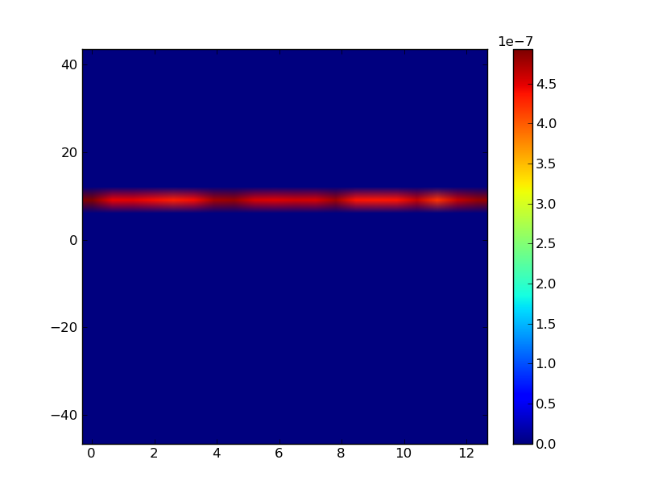
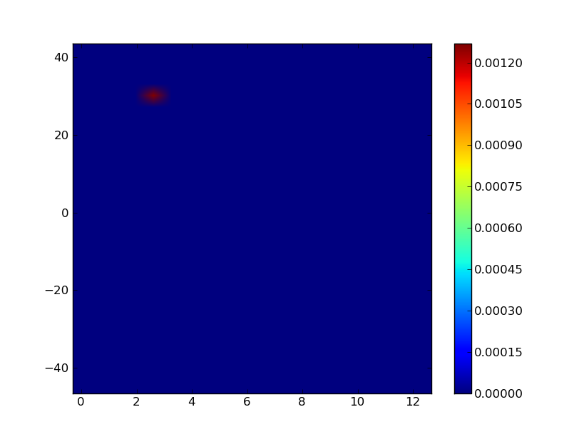
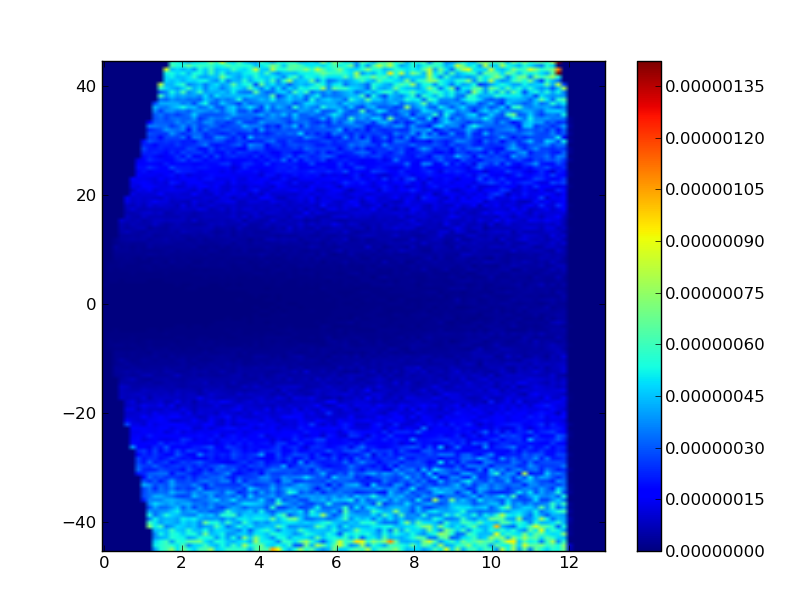

.. _SampleAssembly:

Sample Assembly
---------------

.. note::
   Several tutorials:
   
   * :ref:`Start from here <tutorials-sampleassembly>`
   * :ref:`Sample with powder diffraction kernel <tutorials-powder-kernel>`

Use sample assembly in your simulation application
==================================================
The component type for sample assembly is "SampleAssemblyFromXml"::

 --sample=SampleAssemblyFromXml

The only parameter for this component is the path to the xml file::

 --sample.xml=<xmlfilepath>

Files
=====

A sample assembly consists of several files.

* :ref:`The main xml file <sampleassembly-main-xml>`. 
  That is the file referred to by the "xml" parameter
  of the SampleAssemblyFromXml component.
* One xml file for each neutron scatterer in the sample assembly.

.. _sampleassembly-main-xml:

The main sample assembly xml file
^^^^^^^^^^^^^^^^^^^^^^^^^^^^^^^^^

It contains information about the shapes and materials of the neutron scatterers

Example::

    <?xml version="1.0"?>

    <!DOCTYPE SampleAssembly>

    <SampleAssembly name="Al">

      <PowderSample name="Al" type="sample">
        <Shape>
          <block width="6*cm" height="10*cm" thickness="1*cm" />
        </Shape>
        <Phase type="crystal">
          <ChemicalFormula>Al</ChemicalFormula>
          <xyzfile>Al.xyz</xyzfile>
        </Phase>
      </PowderSample>

      <LocalGeometer registry-coordinate-system="InstrumentScientist">
        <Register name="Al" position="(0,0,0)" orientation="(0,0,0)"/>
      </LocalGeometer>

    </SampleAssembly>

* The outmost tag is always "SampleAssembly".
 * The next level consists of one or more neutron scatterers and one geometer.
 * PowderSample is a neutron scatterer. Its name is important (see :ref:`scatterer-xml`).
  * Inside a neutron scatterer we need to specify its shape and material
  * Shape -- can be represented using constructive solid geometery
  * Phase
 * LocalGeometer is geometer. It contains geometrical information of neutron scatterers

.. _scatterer-xml:

Scatterer xml
^^^^^^^^^^^^^
A neutron scatterer is always assigned with a unique name inside the sample assembly xml
file. There must be one file named <scatterer-name>-scatteer.xml in the same directory
where the sample assembly xml is.

In the above example for sample assembly, there is one scatterer "Al". Therefore,
there must be
an Al-scatterer.xml file ::

    <?xml version="1.0"?>

    <!DOCTYPE scatterer>

    <!-- weights: absorption, scattering, transmission -->
    <homogeneous_scatterer mcweights="0, 1, 0">

      <SimplePowderDiffractionKernel Dd_over_d="1e-5" DebyeWaller_factor="1" peaks-py-path="peaks.py">
      </SimplePowderDiffractionKernel>

    </homogeneous_scatterer>

* A neutron scatterer xml file starts with a tag for the type of the scatterer.
  Currently the only type is "homogeneous_scatterer"
 * Inside a scatterer tag, there is one kernel tag. See :ref:`types of kernels <kernel-types>`.

.. _kernel-types:

Kernels
=======

.. _kernel_isotropic:

Isotropic
^^^^^^^^^
This kernel elastically and isotropically scatters neutrons
to all 4pi solid angle.

Parameters: None

Example::

 <IsotropicKernel/>

You can find a full example in directory "kernels/isotropic" in
`the examples tar ball <http://dev.danse.us/packages/mcvine-examples.tgz>`_

Running it will generate the following plot (a mostly uniform distribution of 
intensities in 4pi solid angle):

.. figure:: images/kernels/isotropickernel-psd4pimonitor.png
   :width: 50%

.. _kernel_constant-energy-transfer:

Constant energy transfer
^^^^^^^^^^^^^^^^^^^^^^^^
This kernel scatters neutrons with a constant energy
transfer

.. math:: E_{f} = E_{i} - E_{constant}
   	  
The scattered neutrons goes
to all 4pi solid angle isotropically.

This kernel is mostly for testing purpose and resolution study.

Parameters: 

- energy-transfer: The energy transfer.

Example::

 <ConstantEnergyTransferKernel energy-transfer="10*meV"/>

You can find a full example in directory "kernels/constant-energy-transfer" in
`the examples tar ball <http://dev.danse.us/packages/mcvine-examples.tgz>`_

Running it will generate the following plot:

.. _kernel_constant-qe:

Constant Q,E
^^^^^^^^^^^^
This kernel scatters neutrons with constant energy
transfer and constant momentum transfer (magnitude)

.. math:: E_{f} = E_{i} - E_{constant}
.. math:: \vec{Q}_{f} = \vec{Q}_{i} - \vec{Q}

where 

.. math:: |\vec{Q}| = Q_{constant}
   	  
This kernel is mostly for testing purpose and resolution study.

Parameters: 

- energy-transfer: The energy transfer
- momentum-transfer: The momentum transfer

Example::

  <ConstantQEKernel momentum-transfer="3/angstrom" energy-transfer="30*meV"/>

You can find a full example in directory "kernels/constant-qe-transfer" in
`the examples tar ball <http://dev.danse.us/packages/mcvine-examples.tgz>`_

Running it will generate the following plot:

.. _kernel_sqe:

S(Q,E)
^^^^^^
This kernel scatters neutrons according to a :math:`S(|\vec{Q}|,E)` input.

Parameters: 

- Q-range: The momentum transfer range
- energy-transfer: The energy transfer range

Elements:

- GridSQE

Example::

  <SQEkernel Q-range='0*angstrom**-1,12.*angstrom**-1' energy-range='-48*meV,48*meV'>
    <GridSQE histogram-hdf-path="sqehist.h5/S(Q,E)" auto-normalization="1" />
  </SQEkernel>

You can find a full example in directory "kernels/sqe" in
`the examples tar ball <http://dev.danse.us/packages/mcvine-examples.tgz>`_

Running it will generate the following plot:

The input for this simulation is an artifical I(Q,E):

.. figure:: images/kernels/iqekernel-iqeinput.png
   :width: 50%

.. .. _kernel_sq:

.. S(Q)
.. ^^^^

.. _kernel_powderdiffr:

powder diffraction (experimental)
^^^^^^^^^^^^^^^^^^^^^^^^^^^^^^^^^
This kernel is for powder diffraction.

Parameters: 

- Dd_over_d
- DebyeWaller_factor
- peaks-py-path

Example::

  <SimplePowderDiffractionKernel Dd_over_d="1e-5" DebyeWaller_factor="1." peaks-py-path="peaks.py"/>

You can find a full example in directory "kernels/powder-diffraction" in
`the examples tar ball <http://dev.danse.us/packages/mcvine-examples.tgz>`_

Running it will generate the following plot:

.. figure:: images/kernels/simplepowderdiffraction-kernel-psd4pi.png
   :width: 50%

.. _kernel_coh_inel_phonon_polyxtal:

Coherent inelastic phonon scattering for polycrystal
^^^^^^^^^^^^^^^^^^^^^^^^^^^^^^^^^^^^^^^^^^^^^^^^^^^^

.. _kernel_coh_inel_phonon_singlextal:

Coherent inelastic phonon scattering for single crysal
^^^^^^^^^^^^^^^^^^^^^^^^^^^^^^^^^^^^^^^^^^^^^^^^^^^^^^

