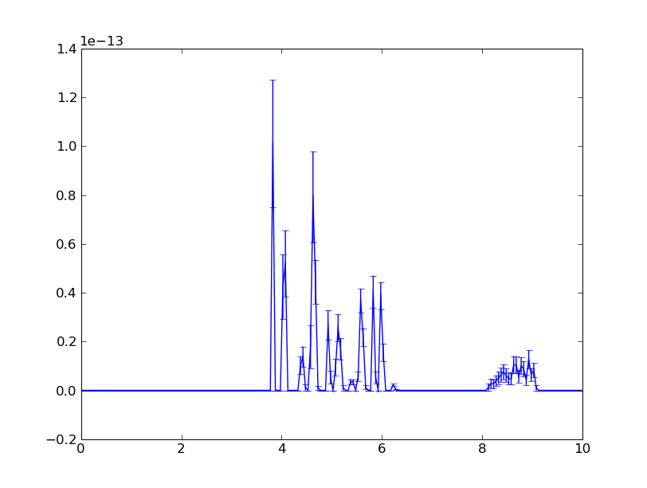

.. _tutorials-powder-kernel:

Tutorials -- Powder Diffraction Kernel
==========================

Simulation with Powder Diffraction Kernel
^^^^^^^^^^^^^^^^^^^^^^^^^^^^^

In this tutorial we will do experiment with a simple instrument consisting of three
components:

::

[Source_simple] -> [PowderDiffractionKernel] -> [NDMonitor(x,y,t)]

that uses **SimplePowderDiffractionKernel**, or simply **Powder Diffraction Kernel**. The structure
of configuration and execution files for the instrument looks like the following:

::

    ssd         # execution Python script
    ssd.pml     # main configuration file
    Al/
        Al-scatterer.xml
        Al.laz
        Al.xyz
        peaks.py
        sampleassembly.xml

The main configuration file ssd.pml defines components, order of components in
the instrument and parameters for each component. Let's take a look at the ssd.pml file

**ssd.pml**

::

    <?xml version="1.0"?>

    <!-- [Source_simple] -> [PowderDiffractionKernel] -> [NDMonitor(x,y,t)] -->

    <!DOCTYPE inventory>

    <inventory>

        <component name="ssd">
            <property name="sequence">['source', 'sample', 'detector']</property>
            <facility name="source">sources/Source_simple</facility>
            <facility name="sample">samples/SampleAssemblyFromXml</facility>
            <facility name="detector">monitors/NDMonitor(x,y,t)</facility>

            <property name="dump-instrument">False</property>
            <property name="overwrite-datafiles">on</property>
            <property name="launcher">mpirun</property>
            <property name="output-dir">out</property>
            <property name="ncount">100000</property>
            <property name="buffer_size">10000</property>
            <property name="multiple-scattering">False</property>
            <property name="mode">worker</property>
            <facility name="geometer">geometer</facility>
            <property name="dump-registry">False</property>

            <component name="source">
                <property name="yh">0.01</property>
                <property name="dist">10.0</property>
                <property name="width">0.0</property>
                <property name="dE">70.0</property>
                <property name="gauss">0.0</property>
                <property name="height">0.0</property>
                <property name="flux">1.0</property>
                <property name="dLambda">0.0</property>
                <property name="radius">0.05</property>
                <property name="Lambda0">0.0</property>
                <property name="E0">100.0</property>
                <property name="xw">0.01</property>
            </component>

            <component name="sample">
                <property name="xml">Al/sampleassembly.xml</property>
            </component>

            <component name="detector">
                <property name="title">ixyt</property>
                <property name="filename">ixyt.h5</property>
                <property name="tmin">0.0</property>
                <property name="tmax">0.002</property>
                <property name="nt">100</property>
                <property name="nx">200</property>
                <property name="ny">200</property>
                <property name="xmax">1.0</property>
                <property name="xmin">-1.0</property>
                <property name="ymin">-1.0</property>
                <property name="ymax">1.0</property>
            </component>

            <component name="geometer">
                <property name="source">((0, 0, 0), (0, 0, 0))</property>
                <property name="sample">((0, 0, 10), (0, 0, 0))</property>
                <property name="detector">((0, 0, 11), (0, 0, 0))</property>
            </component>

        </component>

    </inventory>

::

 Note: Base name of the file ssd.pml should be the same as in tag
       <component name="ssd"> otherwise simulation will silently
       die without doing anything useful.

::

 Note: Name "ssd" stands for initial letters of source -> sample -> detector

The ssd.pml file has three components: ``Source_simple``, ``SampleAssemblyFromXml`` and
``NDMonitor(x,y,t)``. It describes parameters for source and detector components
whereas parameters for sample component are defined in a separate file:
*Al/sampleassembly.xml*. Let's take a closer look at the components.

Source_simple
-------------

Source_simple component is a standard component available in McStas simulation package.
It generates flux of neutrons uniformly distributed in the energy range ``[E0-dE, E0+dE]`` in meV.
In our configuration the energy range is ``[30, 170] meV``. Parameters ``xw``, ``yh`` and
``dist`` define width, height and distance to the sample correspondingly. The benefit
of using this simple source is to quickly get an estimate of what happens to the neutrons
in this energy range as they propagates through the instrument.

SampleAssemblyFromXml
---------------------

The SampleAssemblyFromXml component allows to create a sample from detailed pieces
of information about the material including configuration of unit cell, physical
properties of atoms with respect to the scattered or absorbed neutrons. Please refer
to :ref:`Sample Assebly <tutorials-sampleassembly>` tutorial for some details
of how to write the configuration files for sample assembly.

In this tutorial we will include *SimplePowderDiffractionKernel* in the sample assembly
and describe some properties of the kernel. The purpose of the kernel in the sample
assembly is to define a general mechanism of neutron scattering without
regard to any macroscopic properties of the material. It does though depend on
microscopic properties such as atom species, lattice parameters, symmetry of the
lattice, scattering cross sections etc.

In this experiment we will create a simple sample consisting of Al atoms and will
keep all the configuration files related to the material in *Al* directory. The only
parameter in the *ssd.pml* file related to sample was the name of xml file: *Al/sampleassembly.xml*

**Al/sampleassembly.xml**

::

    <?xml version="1.0"?>

    <!DOCTYPE SampleAssembly>

    <SampleAssembly name="Al">

      <PowderSample name="Al" type="sample">
        <Shape>
          <block width="6*cm" height="10*cm" thickness="1*cm" />
        </Shape>
        <Phase type="crystal">
          <ChemicalFormula>Al</ChemicalFormula>
          <xyzfile>Al.xyz</xyzfile>
        </Phase>
      </PowderSample>

      <LocalGeometer registry-coordinate-system="InstrumentScientist">
        <Register name="Al" position="(0,0,0)" orientation="(0,0,0)"/>
      </LocalGeometer>

    </SampleAssembly>

File *sampleassembly.xml* is the main file that describes general properties of the sample:
shape, phase type, local geometry and some others. Our sample is a block with sizes: ``6cm*10cm*1cm``.
The phase type is a crystal consisting of just one chemical element *Al* and the
unit cell is given in *Al.xyz* file.

**Al/Al.xyz**

::

    4
    4.049320 0 0   0 4.049320 0   0 0 4.049320
    Al 0  0  0
    Al 0.5 0.5 0
    Al 0.5 0 0.5
    Al 0 0.5 0.5

The *Al.xyz* file tells us that the Al atoms comprise FCC unit cell with lattice
constants:

::

 a = b = c = 4.049320 AA

::

 Note: .xyz file used here is not a standard .xyz file. Standard .xyz file
        http://en.wikipedia.org/wiki/XYZ_file_format devotes the 2nd line
        for comment where as in this case we store meaningful information:
        lattice parameters.

If the *Al-scatterer.xml* file is present in *Al* directory, then system will automatically
recognize it and will turn on the scattering process for the sample.

**Al/Al-scatterer.xml**

::

    <?xml version="1.0"?>

    <!DOCTYPE scatterer>

    <!-- weights: absorption, scattering, transmission -->
    <homogeneous_scatterer mcweights="0, 1, 0">

      <SimplePowderDiffractionKernel Dd_over_d="1e-5" DebyeWaller_factor="1" peaks-py-path="peaks.py">
      </SimplePowderDiffractionKernel>

    </homogeneous_scatterer>

*Al-scatterer.xml* configuration file describes the scattering process by defining
the kernel. As mentioned above, we use *SimplePowderDiffractionKernel* for our experiment.
We need to specify several parameters for the kernel: relative line width :math:`\Delta d/d`
(``Dd_over_d``), Debye-Waller factor (``DebyeWaller_factor``) and file containing
information about the diffraction planes (``peaks-py-path``).

**peaks.py**

::

    from mccomponents.sample.diffraction.SimplePowderDiffractionKernel import Peak

    peaks = [
        Peak(q=2.687561, F_squared=1.690000, multiplicity=8, intrinsic_line_width=0.000000, DebyeWaller_factor=1.000000),
        Peak(q=3.103329, F_squared=1.690000, multiplicity=6, intrinsic_line_width=0.000000, DebyeWaller_factor=1.000000),
        Peak(q=4.388769, F_squared=1.440000, multiplicity=12, intrinsic_line_width=0.000000, DebyeWaller_factor=1.000000),
        Peak(q=5.146288, F_squared=1.440000, multiplicity=24, intrinsic_line_width=0.000000, DebyeWaller_factor=1.000000),
        Peak(q=5.375123, F_squared=1.210000, multiplicity=8, intrinsic_line_width=0.000000, DebyeWaller_factor=1.000000),
        Peak(q=6.206657, F_squared=1.210000, multiplicity=6, intrinsic_line_width=0.000000, DebyeWaller_factor=1.000000),
        Peak(q=6.763548, F_squared=1.000000, multiplicity=24, intrinsic_line_width=0.000000, DebyeWaller_factor=1.000000),
        Peak(q=6.939254, F_squared=1.000000, multiplicity=24, intrinsic_line_width=0.000000, DebyeWaller_factor=1.000000),
        Peak(q=7.601572, F_squared=1.000000, multiplicity=24, intrinsic_line_width=0.000000, DebyeWaller_factor=1.000000),
        Peak(q=8.062684, F_squared=0.810000, multiplicity=24, intrinsic_line_width=0.000000, DebyeWaller_factor=1.000000),
        Peak(q=8.062684, F_squared=0.810000, multiplicity=8, intrinsic_line_width=0.000000, DebyeWaller_factor=1.000000),
        Peak(q=8.777539, F_squared=0.640000, multiplicity=12, intrinsic_line_width=0.000000, DebyeWaller_factor=1.000000),
        Peak(q=9.179770, F_squared=0.640000, multiplicity=48, intrinsic_line_width=0.000000, DebyeWaller_factor=1.000000),
        Peak(q=9.309986, F_squared=0.640000, multiplicity=24, intrinsic_line_width=0.000000, DebyeWaller_factor=1.000000),
        Peak(q=9.309986, F_squared=0.640000, multiplicity=6, intrinsic_line_width=0.000000, DebyeWaller_factor=1.000000),
        Peak(q=9.813587, F_squared=0.490000, multiplicity=24, intrinsic_line_width=0.000000, DebyeWaller_factor=1.000000),
        Peak(q=10.174943, F_squared=0.490000, multiplicity=24, intrinsic_line_width=0.000000, DebyeWaller_factor=1.000000),
        Peak(q=10.292577, F_squared=0.490000, multiplicity=24, intrinsic_line_width=0.000000, DebyeWaller_factor=1.000000),
        Peak(q=10.750246, F_squared=0.490000, multiplicity=8, intrinsic_line_width=0.000000, DebyeWaller_factor=1.000000),
        Peak(q=11.081100, F_squared=0.360000, multiplicity=24, intrinsic_line_width=0.000000, DebyeWaller_factor=1.000000),
        Peak(q=11.081100, F_squared=0.360000, multiplicity=24, intrinsic_line_width=0.000000, DebyeWaller_factor=1.000000),
        Peak(q=11.189210, F_squared=0.360000, multiplicity=24, intrinsic_line_width=0.000000, DebyeWaller_factor=1.000000),
        Peak(q=11.611592, F_squared=0.360000, multiplicity=48, intrinsic_line_width=0.000000, DebyeWaller_factor=1.000000),
        Peak(q=11.918560, F_squared=0.360000, multiplicity=24, intrinsic_line_width=0.000000, DebyeWaller_factor=1.000000),
        Peak(q=11.918560, F_squared=0.360000, multiplicity=48, intrinsic_line_width=0.000000, DebyeWaller_factor=1.000000),
        Peak(q=12.413314, F_squared=0.250000, multiplicity=6, intrinsic_line_width=0.000000, DebyeWaller_factor=1.000000),
    ]

*peaks.py* file specifies cumulative parameters based on the Al.laz `powder pattern
file <http://www.mcstas.org/download/components/data/>`_
available in McStas package . We show the Al.laz file here for reference purposes:

**Al/Al.laz**

::

    # TITLE *Aluminum-Al-[FM3-M] Miller, H.P.jr.;DuMond, J.W.M.[1942] at 298 K
    # CELL 4.049320 4.049320 4.049320 90.000000 90.000000 90.000000
    # SPCGRP F M 3 M   CUBIC STRUCTURE
    # ATOM AL 1 0.000000 0.000000 0.000000
    # SCATTERING FACTOR  COEFFICIENTS: AL     F= 0.345 CM-12
    # Reference: Physical Review (1940) 57, 198-206
    #
    # Physical parameters:
    # sigma_coh 1.495   coherent scattering cross section in [barn]
    # sigma_inc 0.0082  incoherent scattering cross section in [barn]
    # sigma_abs 0.231   absorption scattering cross section in [barn]
    # density   2.70    in [g/cm^3]
    # weight    26.98   in [g/mol]
    # nb_atoms  4       in [atoms/unit cell]
    # v_sound   5100    in [m/s]
    # v_sound_l 6420    velocity of longitudinal sound in [m/s]
    # v_sound_t 3040    velocity of transversal sound in [m/s]
    # T_m       933.5   melting temperature in [K]
    # T_b       2792.2  boiling temperature in [K]
    # At_number 13      atomic number Z
    # lattice_a 4.04932 lattice parameter a in [Angs]
    #
    # Format parameters: Lazy format <http://icsd.ill.fr>
    # column_j 17 multiplicity 'j'
    # column_d 6  d-spacing 'd' in [Angs]
    # column_F 13 norm of scattering factor |F| in [barn^0.5]
    # column_h 1
    # column_k 2
    # column_l 3
    #
    # H  K  L  THETA  2THETA D VALUE  1/D**2 SIN2*1000  H  K  L INTENSITY         /F(HKL)/       A(HKL)      B(HKL) PHA.ANG. MULT   LPG
      1  1  1  12.35  24.70   2.3379  0.1830    45.74   1  1  1    1000.0              1.3         1.32         0.00    0.00  8  22.38
      2  0  0  14.30  28.59   2.0247  0.2439    60.99   2  0  0     550.0              1.3         1.30         0.00    0.00  6  16.92
      2  2  0  20.44  40.88   1.4317  0.4879   121.97   2  2  0     503.5              1.2         1.22         0.00    0.00 12   8.75
      3  1  1  24.18  48.35   1.2209  0.6709   167.71   3  1  1     686.4              1.2         1.17         0.00    0.00 24   6.54
      2  2  2  25.32  50.65   1.1689  0.7318   182.96   2  2  2     205.3              1.1         1.15         0.00    0.00  8   6.05
      4  0  0  29.60  59.20   1.0123  0.9758   243.95   4  0  0     106.3              1.1         1.08         0.00    0.00  6   4.71
      3  3  1  32.56  65.13   0.9290  1.1587   289.69   3  3  1     337.1              1.0         1.03         0.00    0.00 24   4.10
      4  2  0  33.52  67.04   0.9055  1.2197   304.93   4  2  0     314.0              1.0         1.02         0.00    0.00 24   3.93
      4  2  2  37.22  74.45   0.8266  1.4637   365.92   4  2  2     242.5              1.0         0.96         0.00    0.00 24   3.43
      5  1  1  39.91  79.82   0.7793  1.6466   411.66   5  1  1     204.2              0.9         0.91         0.00    0.00 24   3.17
      3  3  3  39.91  79.82   0.7793  1.6466   411.66   3  3  3      68.1              0.9         0.91         0.00    0.00  8   3.17
      4  4  0  44.31  88.61   0.7158  1.9516   487.89   4  4  0      79.3              0.8         0.85         0.00    0.00 12   2.86
      5  3  1  46.93  93.86   0.6845  2.1345   533.63   5  3  1     277.3              0.8         0.81         0.00    0.00 48   2.74
      4  4  2  47.81  95.61   0.6749  2.1955   548.88   4  4  2     132.9              0.8         0.80         0.00    0.00 24   2.71
      6  0  0  47.81  95.61   0.6749  2.1955   548.88   6  0  0      33.2              0.8         0.80         0.00    0.00  6   2.71
      6  2  0  51.35 102.69   0.6403  2.4395   609.87   6  2  0     113.9              0.7         0.75         0.00    0.00 24   2.63
      5  3  3  54.07 108.13   0.6175  2.6224   655.61   5  3  3     102.9              0.7         0.72         0.00    0.00 24   2.60
      6  2  2  54.99 109.98   0.6105  2.6834   670.85   6  2  2      99.8              0.7         0.71         0.00    0.00 24   2.60
      4  4  4  58.81 117.63   0.5845  2.9274   731.84   4  4  4      29.9              0.7         0.66         0.00    0.00  8   2.64
      5  5  1  61.86 123.72   0.5670  3.1103   777.58   5  5  1      84.6              0.6         0.63         0.00    0.00 24   2.73
      7  1  1  61.86 123.72   0.5670  3.1103   777.58   7  1  1      84.6              0.6         0.63         0.00    0.00 24   2.73
      6  4  0  62.92 125.85   0.5615  3.1713   792.83   6  4  0      83.4              0.6         0.62         0.00    0.00 24   2.77
      6  4  2  67.52 135.04   0.5411  3.4153   853.82   6  4  2     163.1              0.6         0.59         0.00    0.00 48   3.06
      5  5  3  71.52 143.05   0.5272  3.5982   899.56   5  5  3      85.2              0.6         0.56         0.00    0.00 24   3.51
      7  3  1  71.52 143.05   0.5272  3.5982   899.56   7  3  1     170.5              0.6         0.56         0.00    0.00 48   3.51
      8  0  0  81.05 162.10   0.5062  3.9032   975.79   8  0  0      34.4              0.5         0.52         0.00    0.00  6   6.59

Parameters for *peaks.py* file are automatically generated from *Al.laz* file using
Python script `peak_generator.py <http://dev.danse.us/trac/MCViNE/browser/trunk/instruments/VULCAN/applications/peak_generator.py>`_

::

 Note: For now peak_generator.py can only be used for cubic lattice types

Let's take a closer look at the parameters provided in *peaks.py* file.

Parameters ``q`` is a q-vector in reciprocal lattice related to lattice parameters and
Miller indices (h,k,l). For orthorhombic lattice type q-vector can be simplified as follows:

.. math::
   \bold{q} = (2\pi h/a)\bold{i} + (2\pi k/b)\bold{j} + (2\pi l/c)\bold{k}

with ``a``, ``b`` and ``c`` being the lattice constants. For FCC lattice type it
can be even further simplified to:

.. math::
   \bold{q} = 2\pi/a(h\bold{i} + k\bold{j} + l\bold{k})

so that the magnitude of the q-vector will be:

.. math::
   q = (2\pi/a)\sqrt{h^2 + k^2 + l^2}

Parameter ``F_squared`` is the squared structure factor corresponding to ``|F(hkl)|`` in *Al.laz* file:

::

    F_squared = F(hkl)^2

Parameter  ``multiplicity`` corresponds to column ``MULT`` in *Al.laz* file. Other
parameters ``intrinsic_line_width`` and ``DebyeWaller_factor`` should be obtained
from other experimental data.

NDMonitor(x,y,t)
----------------

The final component in our simple instrument is **NDMonitor**. It is a generic monitor
that can plot various dependencies of physical values: ``x``, ``y``, ``z``, ``vx``,
``vy``, ``vz``, ``w``, ``energy``.
For the instrument we are interested in neutron
distribution in ``(x,y)`` plane within some time range ``t``. For this we will use
``NDMonitor(x,y,t)`` component. Other examples of NDMonitor include ``NDMonitor(w,x)``
where ``w`` is the wavelength, ``NDMonitor(w)``, ``NDMonitor(energy,x)`` etc.
[Need to write a separate section on NDMonitor!!!]

The application script will look as follows:

**ssd**

::

    #!/usr/bin/env python

    import mcvine
    import mccomponents.sample.diffraction.xml

    def main():
        from mcvine.applications.InstrumentBuilder import build
        components = ['source', 'sample', 'detector']
        App = build(components)
        app = App('ssd')
        app.run()
        return

    if __name__ == '__main__':
        main()

After we finished with configuration and execution (application) files, it's time
to run the experiment simulation:

::

 $ python ssd

The results of scattered neutrons is displayed on NDMonitor(x,y,t). To get the neutron
intensity in ``(x,y)`` plane we need to sum neutron intensity over some time period.
For our system we integrated neutrons over the time range ``[0, 002] sec``. To draw
the plot for the monitor we use the script:

**plot_ndmonitor.py**

::

    #!/usr/bin/env python

    # Note: Before using this script make sure that "out/ixyt.h5" is generated!
    from histogram.hdf import load
    from histogram.plotter import defaultPlotter as dp

    h   = load('out/ixyt.h5', 'ix_y_t')
    ixy = h.sum('t')

    dp.plot(ixy)

This produces the diffraction image where every ring corresponds to separate
diffraction plane, or separate combination of Miller indices (h,k,l)

.. figure:: images/powder-kernel.png
   :width: 600px

   *Fig. 1 Diffraction with SimplePowderDiffractionKernel*

Simulation with PowderN
^^^^^^^^^^^^^^^^^^^^^^^

In the previous section we used ``SimplePowderDiffractionKernel`` and assembled
our sample using different pieces of information about material structure and
macroscopic parameters. We can achieve the same result using standard McStas component
for powder sample called ``PowderN.comp``. You might ask, why you actually need to have
PowderDiffractionKernel when one can use ``PowderN`` component instead. The answer is that PowderDiffractionKernel
allows more flexibility in defining your sample, especially when you want to investigate
a complex structure for which the powder pattern file is not available.

Let's replace ``SampleAssemblyFromXml`` component by ``PowderN`` and see if results
are consistent.

**ssd2.pml**

::

    <?xml version="1.0"?>

    <!-- [Source_simple] -> [PowderN] -> [NDMonitor(x,y,t)] -->

    <!DOCTYPE inventory>

    <inventory>

        <component name="ssd2">
            <property name="sequence">['source', 'sample', 'detector']</property>
            <facility name="source">sources/Source_simple</facility>
            <facility name="sample">samples/SampleAssemblyFromXml</facility>
            <facility name="detector">monitors/NDMonitor(x,y,t)</facility>

            <property name="dump-instrument">False</property>
            <property name="overwrite-datafiles">on</property>
            <property name="launcher">mpirun</property>
            <property name="output-dir">out</property>
            <property name="ncount">100000</property>
            <property name="buffer_size">10000</property>
            <property name="multiple-scattering">False</property>
            <property name="mode">worker</property>
            <facility name="geometer">geometer</facility>
            <property name="dump-registry">False</property>

            <component name="source">
                <property name="yh">0.01</property>
                <property name="dist">10.0</property>
                <property name="width">0.0</property>
                <property name="dE">70.0</property>
                <property name="gauss">0.0</property>
                <property name="height">0.0</property>
                <property name="flux">1.0</property>
                <property name="dLambda">0.0</property>
                <property name="radius">0.05</property>
                <property name="Lambda0">0.0</property>
                <property name="E0">100.0</property>
                <property name="xw">0.01</property>
            </component>

        <component name="sample">
            <property name="reflections">Al.laz</property>
            <property name="xwidth">0.06</property>
            <property name="yheight">0.1</property>
            <property name="zthick">0.01</property>
            <property name="DW">1</property>
            <property name="Delta_d">1e-5</property>
            <property name="frac">0</property>
            <property name="tfrac">0</property>
        </component>

            <component name="detector">
                <property name="title">ixyt</property>
                <property name="filename">ixyt.h5</property>
                <property name="tmin">0.0</property>
                <property name="tmax">0.002</property>
                <property name="nt">100</property>
                <property name="nx">200</property>
                <property name="ny">200</property>
                <property name="xmax">1.0</property>
                <property name="xmin">-1.0</property>
                <property name="ymin">-1.0</property>
                <property name="ymax">1.0</property>
            </component>

            <component name="geometer">
                <property name="source">((0, 0, 0), (0, 0, 0))</property>
                <property name="sample">((0, 0, 10), (0, 0, 0))</property>
                <property name="detector">((0, 0, 11), (0, 0, 0))</property>
            </component>

        </component>

    </inventory>

When configuring ``PowderN`` component we intentionally excluded incoherently
scattered ``frac`` and transmitted ``tfrac`` neutrons.

::

    <component name="sample">
        ...
        <property name="frac">0</property>
        <property name="tfrac">0</property>
    </component>

We slightly update application script ...

**ssd2**

::

    #!/usr/bin/env python

    import mcvine
    import mccomponents.sample.diffraction.xml

    def main():
        from mcvine.applications.InstrumentBuilder import build
        components = ['source', 'sample', 'detector']
        App = build(components)
        app = App('ssd2')
        app.run()
        return

    if __name__ == '__main__':
        main()

and run again the experiment simulation.

::

 $ python ssd2

As you can see we get a very similar picture to what we obtained in the first section
using  ``SimplePowderDiffractionKernel``. Results for ``SimplePowderDiffractionKernel``
and ``PowderN`` component look consistent.

.. figure:: images/powderN.png
   :width: 600px

   *Fig. 2 Diffraction with PowderN component*

Wave Vector Sensitive Monitor
^^^^^^^^^^^^^^^^^^^^^^^^^^^^^^^^^^^^^^

Let's now change our initial instrument configuration by replacing ``NDMonitor(x,y,t)``
by ``NDMonitor(q)`` as shown below:

::

[Source_simple] -> [PowderDiffractionKernel] -> [NDMonitor(q)]

The monitor ``NDMonitor(q)`` is sensitive to the wave vector. Our new configuration
files will look like:

**ssd3.pml**

::

    <?xml version="1.0"?>

    <!-- [Source_simple] -> [PowderDiffractionKernel] -> [NDMonitor(q)] -->

    <!DOCTYPE inventory>

    <inventory>

        <component name="ssd3">
            <property name="sequence">['source', 'sample', 'detector']</property>
            <facility name="source">sources/Source_simple</facility>
            <facility name="sample">samples/SampleAssemblyFromXml</facility>
            <facility name="detector">monitors/NDMonitor(q)</facility>

            <property name="dump-instrument">False</property>
            <property name="overwrite-datafiles">on</property>
            <property name="launcher">mpirun</property>
            <property name="output-dir">out</property>
            <property name="ncount">100000</property>
            <property name="buffer_size">10000</property>
            <property name="multiple-scattering">False</property>
            <property name="mode">worker</property>
            <facility name="geometer">geometer</facility>
            <property name="dump-registry">False</property>

            <component name="source">
                <property name="yh">0.01</property>
                <property name="dist">10.0</property>
                <property name="width">0.0</property>
                <property name="dE">70.0</property>
                <property name="gauss">0.0</property>
                <property name="height">0.0</property>
                <property name="flux">1.0</property>
                <property name="dLambda">0.0</property>
                <property name="radius">0.05</property>
                <property name="Lambda0">0.0</property>
                <property name="E0">100.0</property>
                <property name="xw">0.01</property>
            </component>

            <component name="sample">
                <property name="xml">Al/sampleassembly.xml</property>
            </component>

            <component name="detector">
                <property name="title">iq</property>
                <property name="filename">iq.h5</property>
                <property name="xwidth">0.5</property>
                <property name="yheight">0.5</property>
                <property name="qmin">0.0</property>
                <property name="qmax">10.0</property>
                <property name="nq">200</property>
            </component>

            <component name="geometer">
                <property name="source">((0, 0, 0), (0, 0, 0))</property>
                <property name="sample">((0, 0, 10), (0, 0, 0))</property>
                <property name="detector">((0, 0, 11), (0, 0, 0))</property>
            </component>

        </component>

    </inventory>

**ssd3**

::

    #!/usr/bin/env python

    import mcvine
    import mccomponents.sample.diffraction.xml

    def main():
        from mcvine.applications.InstrumentBuilder import build
        components = ['source', 'sample', 'detector']
        App = build(components)
        app = App('ssd3')
        app.run()
        return

    if __name__ == '__main__':
        main()

Running experiment simulation

::

 $ python ssd3
 $ PlotHist.py out/iq.h5

we get the plot I(q), where wave vector (q) has units 1/AA and intensity (I)
has arbitrary units:

   *Fig. 3 Diffraction with SimplePowderDiffractionKernel and NDMonitor(q)*

Due to the fact that the monitor detects the vector component perpendicular
to the monitor only :math:`q_z`, selective values of the wave vector will be
displayed. In `Al.laz` file we provided 26 diffraction planes and this should correspond
to the 26 diffraction peaks in the detector. The only condition for that is that
it should be large enough to include all of the diffraction rings.

